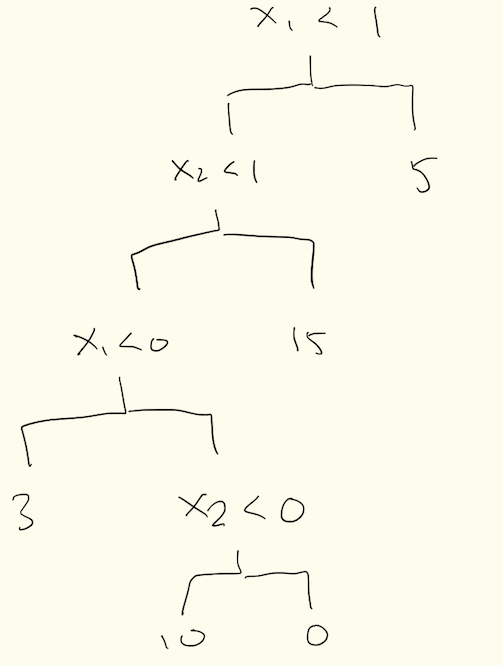

## SUID ending in 0710
tcjiang108@gmail.com

```{r,include=FALSE}
library(ISLR)
library(glmnet)
library(tree)
library(randomForest)
```

## Problem 1

Chapter 6, Exercise 3 (p. 260). 

### a) 
iv Steadily decrease. At s=0, all estimators are equal to zero and we have a null model. As s increases, the estimators approach their least square estimate values and the RSS decreases to what ordinary least squares would yield. 

### b)
ii Decrease initially, then eventually start increasing. At s=0 and null model, test RSS will be high as the model has very high bias. As s increases there will be a point where the model fits the data well and test RSS decreases, before test RSS increases again due to overfitting and high variance

### c) 

iii. Steadily increase. At s=0, the model will output a constant value and there is very low variance. As s increases the model becomes more flexible and variance increases. 

### d)

iv. Steadily decrease. As s increases the model becomes more flexible and squared bias will fall. 

### e) 

v. Remain constant. Irreducible error is independent of model coefficients and shrinknage methods. 

## Problem 2

Chapter 6, Exercise 4 (p. 260). 

### a)
Steadily increase: at lambda=0, the Beta estimates are at their ordinary least squares value. As lamdba increases the estimators approach 0 e.g. the null model thus training RSS steadily increases with lambda

### b)
Decreases initially, then eventually increasing in a U shape. At lambda = 0, all Beta estimates are uneffected from their ordinary least squared model values. If there is overfitting, as lambda increases the beta values move towards zero and the overfitting is reduced, thus there will be a point where the model is optimal and test RSS is at its low point. However, as lambda increases further the model becomes underfit and test RSS will increase. 

### c)
Steadily decreases; As lambda increases from 0 the model becomes simpler, less flexible and variance will fall

### d)
Steadily increases; As lambda increases from 0 the model goes from having estimator values similar to an ordinary least squared model all the way to a null model. Along the way the model becomes underfit and bias increases. 

### e)
v. Remain constant. Irreducible error is independent of model coefficients and shrinknage methods. 

## Problem 3

Chapter 6, Exercise 9 (p. 263). Don't do parts (e), (f), and (g).

### a)
```{r}
set.seed(100)
train <- sample(1:nrow(College), nrow(College)/2)
test <- (-train)
train_college  <- College[train, ]
test_college <- College[test, ]

dim(train_college)
dim(test_college)
dim(College)
```

### b)

```{r}
linear_model <- lm(Apps~., data=train_college)
pred <- predict(linear_model, test_college)
sprintf('Test RSS of linear model: %0.2f',mean((test_college[,'Apps'] - pred)^2))
```

### c)

```{r}
train_mat <- model.matrix(Apps~., data=train_college)
test_mat <- model.matrix(Apps~., data=test_college)
grid <- 10^seq(10, -2, length=100)
ridge_mod <- cv.glmnet(train_mat, train_college[,'Apps'], alpha=0, lambda=grid, thresh =1e-12)
optimal_lambda <- ridge_mod$lambda.min
pred <- predict(ridge_mod, newx=test_mat, s=optimal_lambda)
sprintf('Test RSS of ridge regression model: %0.2f', mean((test_college[,'Apps'] - pred)^2))
```


### d)

```{r}
lasso_mod <- cv.glmnet(train_mat, train_college[,'Apps'], alpha=1, lambda=grid, thresh =1e-12)
optimal_lambda_lasso <- lasso_mod$lambda.min
pred <- predict(lasso_mod, newx=test_mat, s=optimal_lambda_lasso)
sprintf('Test RSS of LASSO model: %0.2f', mean((test_college[,'Apps'] - pred)^2))
```


## Problem 4

Chapter 8, Exercise 4 (p. 332).


### a)


\pagebreak

### b) 


\pagebreak

## Problem 5

Chapter 8, Exercise 8 (p. 333).

### a)

```{r}
set.seed(100)
attach(Carseats)
train <- sample(1:nrow(Carseats), nrow(Carseats)/2)
test <- (-train)
train_carseats  <- Carseats[train, ]
test_carseats <- Carseats[test, ]

dim(train_carseats)
dim(test_carseats)
dim(Carseats)
```

### b) 

```{r,fig.width=10, fig.height=10,}
tree_carseats <- tree(Sales~., data=train_carseats)
# summary(Carseats)
summary(tree_carseats)
plot(tree_carseats)
text(tree_carseats, pretty=0)
```

Carseats is a dataset of child carseat sales at 400 stores. Only six of the variables in Carseats have been used in constructing the tree. ShelveLoc is a factor indicating the quality of shelving locations for carseats at each store. The tree indicates that bad and medium shelving location qualities corresponds to lower carseat sales. The tree predicts highest sales of 12.74k carseats at stores with good shelving locations and a price of less than $113. 

```{r}
pred <- predict(tree_carseats, test_carseats)
sprintf('the test MSE obtained is %0.2f', mean((test_carseats$Sales - pred)^2))
```


### c)

```{r}
set.seed(3)
cv_carseats <- cv.tree(tree_carseats, FUN=prune.tree)
cv_carseats
```

dev corresponds to the cross-validation error rate. The tree with 11 terminal nodes results in the lowest cross-validation error rate. 

```{r}
par(mfrow=c(1,2))
plot(cv_carseats$size, cv_carseats$dev, type='b')
plot(cv_carseats$k, cv_carseats$dev, type='b')
```

```{r,fig.width=10, fig.height=10,}
pruned <- prune.tree(tree_carseats, best=11)
plot(pruned)
text(pruned, pretty=0)
pred <- predict(pruned, test_carseats)
sprintf('In this problem pruning the tree did not improve test MSE; test MSE increased to %0.2f',mean((test_carseats$Sales - pred)^2))
```


### d)

```{r}
set.seed(1)
# dim(Carseats)
bag <- randomForest(Sales~., data=train_carseats, mtry=10, ntree=25,
                    importance=TRUE)
pred <- predict(bag, test_carseats)
sprintf('using bagging, test MSE improved to %0.2f', 
        mean((test_carseats$Sales-pred)^2))
```
```{r}
importance(bag)
```

ShelveLoc and price are the most important predictors of Sales

### e)

```{r}
for (m in 1:10) {
  set.seed(1)
  rf_carseats <- randomForest(Sales~., data=train_carseats, mtry=m,
                              importance=TRUE)
  pred <- predict(rf_carseats, test_carseats)
  x <- sprintf('using random forests with m of %d, obtained test MSE of %0.2f', 
          m, mean((test_carseats$Sales-pred)^2))
  print(x)
}
```

Changing the m value yields test MSE range of 3.2 to 4.85, with 5 predictors being considered at each split giving the optimal result. 

```{r}
importance(rf_carseats)
```

Again, Price and ShelveLoc are the two most important predictors of Sale. 