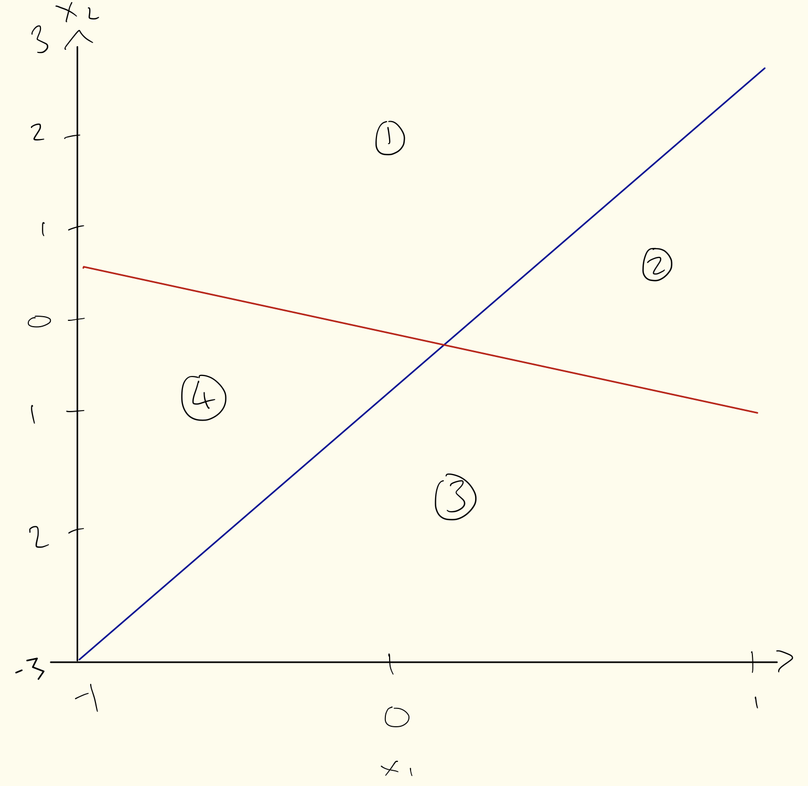

## SUID ending in 0710
tcjiang108@gmail.com

Load required libraries

```{r,include=FALSE}
library(ISLR)
library(gbm)
library(glmnet)
library(randomForest)
library(class)
options(max.print=1000000)
library(e1071)
```

## Problem 1
Chapter 8, Exercise 10 (p. 334). 

### a)
```{r}
clean_Hitters <- Hitters[-which(is.na(Hitters$Salary)), ]
clean_Hitters$Salary_tr <- log(clean_Hitters$Salary) 
#drop the non-transformed salary vector
clean_Hitters <- subset(clean_Hitters, select=-c(Salary))
```

### b)
```{r}
indices <- 1:200
train_set <- clean_Hitters[indices, ]
test_set <- clean_Hitters[-indices, ]
```

### c)
```{r}
set.seed(1)
pows <- seq(-10, -0.2, by=0.1)
lambdas <- 10^pows
train_err <- rep(NA, length(lambdas))
for (i in 1:length(lambdas)) {
    boost_hitters <- gbm(Salary_tr~., data=train_set, distribution="gaussian", n.trees=1000, shrinkage=lambdas[i])
    pred_train <- predict(boost_hitters, train_set, n.trees=1000)
    train_err[i] <- mean((pred_train - train_set$Salary_tr)^2)
}
plot(lambdas, train_err, type = "b", xlab = "shrinkage", ylab = "train MSE")
```

### d)
```{r}
set.seed(1)
test_err <- rep(NA, length(lambdas))
for (i in 1:length(lambdas)) {
    boost_hitters <- gbm(Salary_tr~., data=test_set, distribution="gaussian", n.trees=1000, shrinkage=lambdas[i])
    pred_test <- predict(boost_hitters, test_set, n.trees=1000)
    test_err[i] <- mean((pred_test - test_set$Salary_tr)^2)
}
plot(lambdas, test_err, type = "b", xlab = "shrinkage", ylab = "test MSE")
```

### e)
```{r}
fit_slr <- lm(Salary_tr~., data = train_set)
pred <- predict(fit_slr, test_set)
sprintf('test MSE from linear regression: %0.3f', mean((pred - test_set$Salary_tr)^2))
```

```{r}
x_train <- model.matrix(Salary_tr~., data = train_set)
x_test <- model.matrix(Salary_tr~., data = test_set)
y <- train_set$Salary_tr
fit <- glmnet(x_train, y, alpha = 0)
pred <- predict(fit, s = 0.01, newx = x_test)
sprintf('test MSE from regularized linear regression: %0.3f', mean((pred - test_set$Salary_tr)^2))
```

Boosting with shrinknage can dramatically outperform both linear regression and ridge regression in terms of test MSE

### f)
```{r}
res <- gbm(Salary_tr~., data=train_set, distribution='gaussian', n.trees=1000, shrinkage=lambdas[which.min(test_err)])
summary(res)
```

CAtBat is the most important predictor in the boosted model, followed by PutOuts, CHmRun and CRuns etc

### g)
```{r}
set.seed(1)
rf_model <- randomForest(Salary_tr~., data=train_set, mtry=13)
pred <- predict(rf_model, test_set)
sprintf('test MSE using bagging: %0.3f', mean((pred - test_set$Salary_tr)^2))
```


## Problem 2
Chapter 8, Exercise 11 (p. 335). 

### a)
```{r}
indices <- 1:1000
train_set <- Caravan[indices, ]
test_set <- Caravan[-indices, ]
```

### b)
```{r}
train_set$Purchase <- ifelse(train_set$Purchase == 'Yes', 1, 0)
test_set$Purchase <- ifelse(test_set$Purchase == 'Yes', 1, 0)
mod <- gbm(Purchase~., data=train_set, shrinkage=0.01, n.trees=1000, distribution='bernoulli')
summary(mod)
```

** TJ: PPERSAUT, MKOOPKLA and MOPLHOOG appear to be the most important predictors **

### c)
```{r}
pred <- predict(mod, test_set, n.trees=1000, type='response')
pred <- ifelse(pred > 0.2, 1, 0)
# table(test_set$Purchase, pred)
table(test_set$Purchase, pred)

sprintf('Approximately %0.3f percent of people predicted to make a purchase do in fact make one', 100*32/(129+32))
```

```{r, include=FALSE}
mod <- glm(Purchase~., data=train_set, family=binomial)
pred <- predict(mod, test_set, type='response')
pred = ifelse(pred > 0.2, 1, 0)
```
```{r}
table(test_set$Purchase, pred)
sprintf('Using a logistic regression model, %0.3f percent of people predicted to make a purchase do in fact make one', 100*58/(350+58))
```


```{r}
train_predictors <- subset(train_set, select = -c(Purchase) )
test_predictors <- subset(test_set, select = -c(Purchase) )
knn_pred <- knn(train_predictors, test_predictors, train_set$Purchase)
table(test_set$Purchase, knn_pred)
sprintf('Using a KNN model with k=1, %0.3f percent of people predicted to make a purchase do in fact make one', 100*26/(273+26))
```

** Boosting performed better than both logistic regression and KNN in predicting the people who actually make purchases **

## Problem 3
Chapter 9, Exercise 1 (p. 368). 



\pagebreak

$$\text{Region labeled 1: set of points for which } 1 + 3X_1 − X_2 < 0 \text{ and } −2 + X_1 + 2X_2 > 0 $$
$$\text{Region labeled 2: set of points for which } 1 + 3X_1 − X_2 > 0 \text{ and } −2 + X_1 + 2X_2 > 0 $$
$$\text{Region labeled 3: set of points for which } 1 + 3X_1 − X_2 > 0 \text{ and } −2 + X_1 + 2X_2 < 0 $$
$$\text{Region labeled 4: set of points for which } 1 + 3X_1 − X_2 < 0 \text{ and } −2 + X_1 + 2X_2 < 0 $$

## Problem 4
Chapter 9, Exercise 8 (p. 371). 

### a)

```{r}
set.seed(1)
indices <- sample(dim(OJ)[1], 800)
train_set <- OJ[indices, ]
test_set <- OJ[-indices, ]
```

### b)
The wording is strange int he problem definition. The SVM package defaults to a radial kernel but part f explicitly asks for svm with a radial kernel. Based on context i'll start part b using svm with a linear kernel

```{r}
model = svm(Purchase~., data=train_set, kernel='linear', cost=0.01)
summary(model)
```

432 support vectors were created: 215 for level CH and 217 for level MM

### c)
```{r}
set.seed(1)
pred <- predict(model, train_set)
table(train_set$Purchase, pred)
sprintf('training error is %0.3f', (78+55)/(78+55+439+228))
```

```{r}
pred = predict(model, test_set)
table(test_set$Purchase, pred)
sprintf('test error is %0.3f', (31+18)/(31+18+80+141))
```


### d)
```{r}
set.seed(1)
tuned_model = tune(svm, Purchase~., data=train_set, kernel="linear", ranges=list(cost=10^seq(-2, 1, by=0.25)))
summary(tuned_model)
```

### e)
Using the opticmal cost of 0.01778279 from step d:

```{r}
opt_model = svm(Purchase~., data=train_set, kernel='linear', cost=0.01778279)
pred <- predict(opt_model, train_set)
table(train_set$Purchase, pred)
sprintf('training error using model with optimal cost from tune() function is %0.3f', (72+56)/(72+56+438+234))
```

```{r}
pred = predict(opt_model, test_set)
table(test_set$Purchase, pred)
sprintf('test error using model with optimal cost from tune() function is %0.3f', (31+19)/(31+19+80+140))
```

### f)
```{r}
model = svm(Purchase~., data=train_set)
summary(model)
```
Using a radial kernel, 379 support vectors were created: 188 for level CH and 191 for level MM

```{r}
set.seed(1)
pred <- predict(model, train_set)
table(train_set$Purchase, pred)
sprintf('training error is %0.3f', (77+39)/(77+39+455+229))
```
```{r}
pred = predict(model, test_set)
table(test_set$Purchase, pred)
sprintf('test error is %0.3f', (28+18)/(28+18+83+141))
```
```{r}
set.seed(1)
tuned_model = tune(svm, Purchase~., data=train_set, kernel='radial', ranges=list(cost=10^seq(-2, 1, by=0.25)))
summary(tuned_model)
```
```{r}
opt_model = svm(Purchase~., data=train_set, kernel='linear', cost=0.5623413)
pred <- predict(opt_model, train_set)
table(train_set$Purchase, pred)
sprintf('training error using model with optimal cost from tune() function is %0.3f', (72+55)/(72+55+439+234))
```
```{r}
pred = predict(opt_model, test_set)
table(test_set$Purchase, pred)
sprintf('test error using model with optimal cost from tune() function is %0.3f', (30+19)/(30+19+81+140))
```
### g)
```{r}
model = svm(Purchase~., data=train_set, kernel = "poly", degree = 2)
summary(model)
```
Using a second order polynomial kernel, 454 support vectors were created: 224 for level CH and 230 for level MM

```{r}
set.seed(1)
pred <- predict(model, train_set)
table(train_set$Purchase, pred)
sprintf('training error is %0.3f', (105+33)/(105+33+461+201))
```
```{r}
pred = predict(model, test_set)
table(test_set$Purchase, pred)
sprintf('test error is %0.3f', (41+10)/(41+10+149+70))
```
```{r}
set.seed(1)
tuned_model = tune(svm, Purchase~., data=train_set, kernel='poly', degree=2, ranges=list(cost=10^seq(-2, 1, by=0.25)))
summary(tuned_model)
```
```{r}
opt_model = svm(Purchase~., data=train_set, kernel='linear', cost=5.623413)
pred <- predict(opt_model, train_set)
table(train_set$Purchase, pred)
sprintf('training error using model with optimal cost from tune() function is %0.3f', (68+56)/(68+56+438+238))
```
```{r}
pred = predict(opt_model, test_set)
table(test_set$Purchase, pred)
sprintf('test error using model with optimal cost from tune() function is %0.3f', (30+18)/(30+18+80+141))
```

### h)
With optimal cost using the tune() function, SVM with linear kernel yielded train error of 0.160 and test error of 0.185; SVM with radial kernel yielded train error of 0.159 and test error of 0.181; SVM with 2nd order polynomial kernel yielded train error of 0.155 and test error of 0.178. 

Overall, SVM using 2nd order polynomial kernel gives the best results on this data. 


